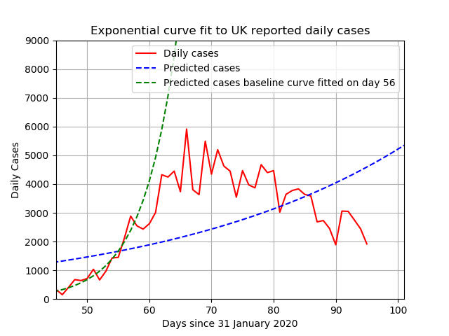
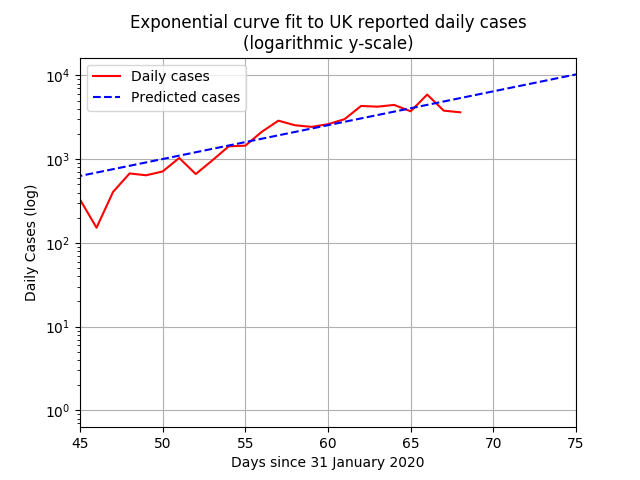
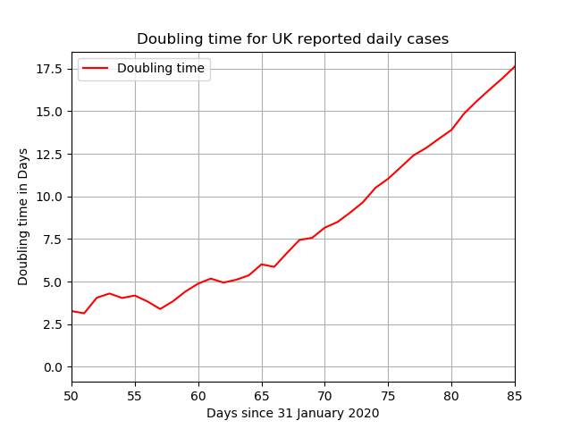
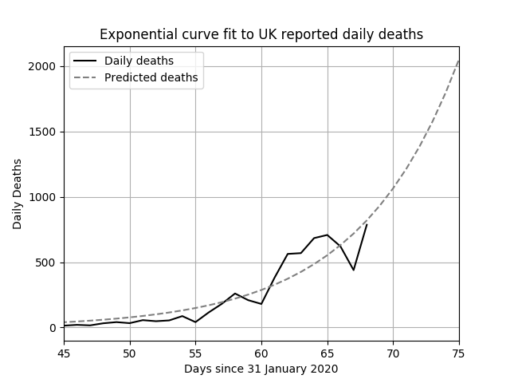
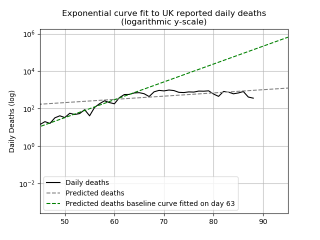
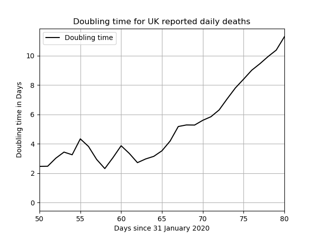
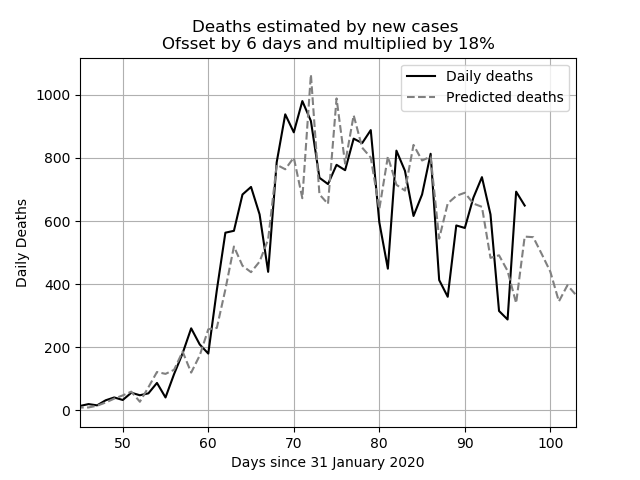

# UK COVID-19 Curves

This project contains some Python code that fits exponential curves to
official UK COVID-19 data that is released daily here: <https://www.arcgis.com/home/item.html?id=e5fd11150d274bebaaf8fe2a7a2bda11>

The following graph shows the doubling time for new cases (up is good)

The following graph shows the doubling time for deaths (up is good)

The following graph shows how the daily cases, offset by the stated number of days,
and  multiplied by the factor (%), mapped against actual deaths reported.
The offset (or lag) and factor are determined by brute force:
It is the combination that produces the lowest error.

Output Details
--------------
<h3>Exponential function coefficients for new cases</h3>
[2.72354661 1.12215186]
<h4>Covariance of coefficients</h4>
[[ 8.85306500e-01 -5.93463728e-03]
 [-5.93463728e-03  3.99821581e-05]]
<h3>Exponential function coefficients for daily deaths</h3>
[0.0022447  1.21709091]
<h4>Covariance of coefficients</h4>
[[ 1.30213371e-06 -1.12049150e-05]
 [-1.12049150e-05  9.65744777e-05]]  
<h3>Best offset and factor for third graph</h3>
7 26%
<h4>Average Error</h4>
14.09
  Last updated on 2020-04-05 12:53:42.642640
