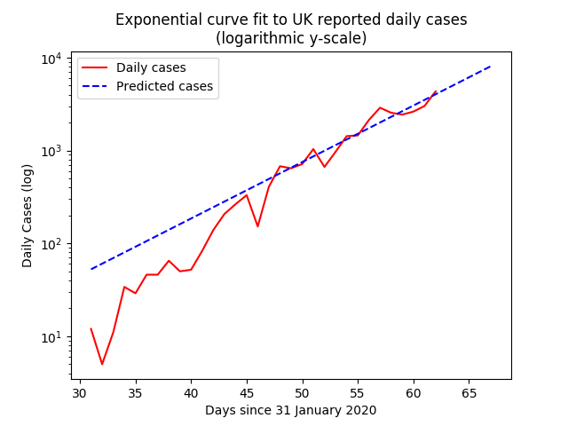
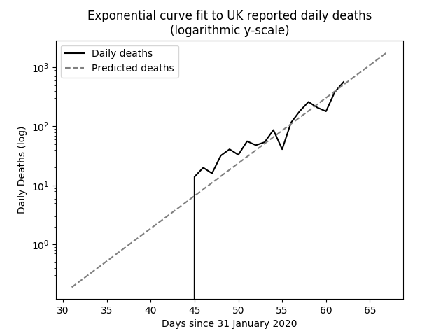

# UK COVID-19 Curves

This project contains some Python code that fits exponential curves to
official UK COVID-19 data that is released daily here: (https://www.arcgis.com/home/item.html?id=e5fd11150d274bebaaf8fe2a7a2bda11)

The following graph shows how the daily cases, offset by the stated number of days,
and  multiplied by the factor (%), mapped against actual deaths reported.
The offset (or lag) and factor are determined by brute force:
It is the combination that produces the lowest error.

Output Details
--------------
<h3>Exponential function coefficients for new cases</h3>
[0.68559076 1.1502348 ]
<h4>Covariance of coefficients</h4>
[[ 1.26549610e-01 -3.59215570e-03]
 [-3.59215570e-03  1.02333242e-04]]
<h3>Exponential function coefficients for daily deaths</h3>
[6.96579902e-05 1.29024605e+00]
<h4>Covariance of coefficients</h4>
[[ 7.66788961e-09 -2.34440786e-06]
 [-2.34440786e-06  7.17525515e-04]]  
<h3>Best offset and factor for third graph</h3>
7 25%
<h4>Average Error</h4>
27.05
