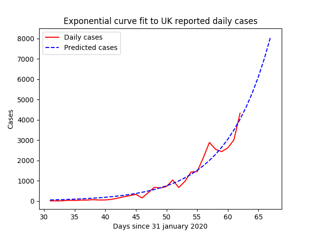
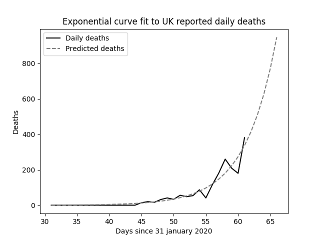
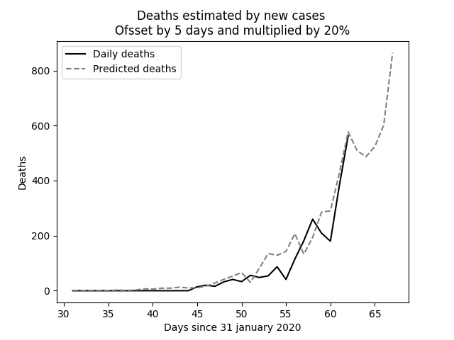

# UK COVID-19 Curves

This project contains some Python code that fits exponential curves to
official UK COVID-19 data that is released daily.

The following graph shows how the daily cases, offset by the stated number of days,
and  multiplied by the factor (%), map against actual deaths reported.
The offset (or lag) and factor are determined by brute force:
It is the combination that produces the lowest squared error.

Output details:
---------------
Exponential function coefficients for new cases:
[0.68559076 1.1502348 ]
Covariance of coefficients:
[[ 1.26549610e-01 -3.59215570e-03]
 [-3.59215570e-03  1.02333242e-04]]
Exponential function coefficients for daily deaths:
[6.96579902e-05 1.29024605e+00]
Covariance of coefficients:
[[ 7.66788961e-09 -2.34440786e-06]
 [-2.34440786e-06  7.17525515e-04]]
Best offset and factor
5 20%
Average Error
46.31
