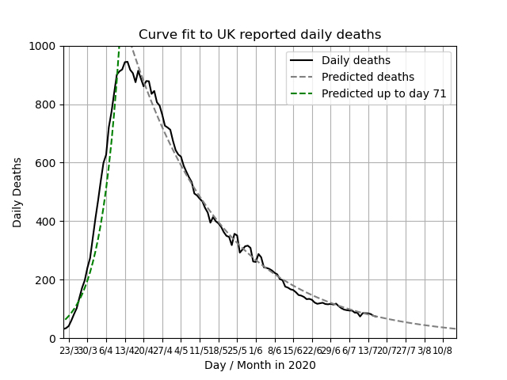

# UK COVID-19 Curves

Given the reporting dip every weekend the script now uses a moving 7 day moving average.
This project contains some Python code that used to fit exponential curves to
official UK COVID-19 data that is released daily here: https://www.gov.uk/guidance/coronavirus-covid-19-information-for-the-public

The curves have become less relevant every day as the data is fortunately not
following an exponential curve any more. Therefore a new line fit was introduced
on 11 May.

Since 10 April positive tests have been divided into pillars. This data set only uses Pillar 1 -  just people that have been hospitalised and most critical key workers,
this ensures consistency with the previous data and is a better indicator for
the last graph.
A green line has been added, this shows the exponential curve calculated using
the data up to day 65, the peak. This estimates what would
have happened without intervention.

These graphs now show all deaths.
A green line has been added, this shows the exponential curve calculated using
the data up to day 71, the peak. This estimates what  
would have happened without intervention.

The following graph shows how the daily cases, offset by the stated number of days,
and  multiplied by the factor (%), mapped against actual deaths reported.
The offset (or lag) and factor are determined by brute force:
It is the combination that produces the lowest error.

Output Details
--------------
<h3>Line coefficients for new cases</h3>
[10430.27602257   -82.23706529]
<h4>Covariance of coefficients</h4>
[[ 5.90324304e+04 -6.32167791e+02]
 [-6.32167791e+02  6.94689880e+00]]
<h3>Fit coefficients for daily deaths</h3>
[1801.60936273  -13.02455452]
<h4>Covariance of coefficients</h4>
[[ 4.80550256e+02 -4.99499524e+00]
 [-4.99499524e+00  5.28570926e-02]]  
<h3>Best offset and factor for third graph</h3>
4 18%
<h4>Average Error</h4>
29.24
  Last updated on 2020-05-25 21:59:23.948417
