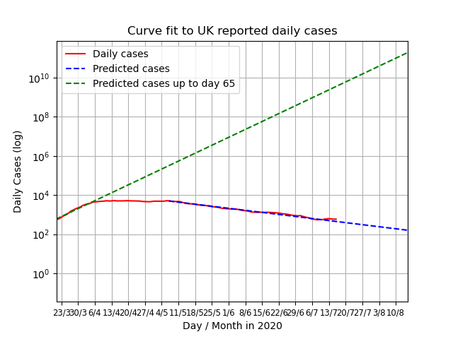

# UK COVID-19 Curves

Since 13 July the data was refreshed retrospectively to now contain all positive tests and all deaths.
This was done due to changes in reporting.

Given the reporting dip every weekend the script now uses a moving 7 day moving average.

This project contains some Python code that used to fit exponential curves to
official UK COVID-19 data that is released daily here: https://www.gov.uk/guidance/coronavirus-covid-19-information-for-the-public

A green line shows the exponential curve calculated using
the data up to day 65, the peak. This estimates what would
have happened without intervention.
The blue line shows the exponential curve fitted starting on 7 May.

These graphs now show all deaths.
A green line shows the exponential curve calculated using the data up to day 71, the peak.
This estimates what would have happened without intervention.
The grey line shows the exponential curve fitted starting on 15 April.

The following graph shows how the daily cases, offset by the stated number of days,
and  multiplied by the factor (%), mapped against actual deaths reported.
The offset (or lag) and factor are determined by brute force:
It is the combination that produces the lowest error. The switch to all positive
tests, rather than just Pillar 1 has made this approach less accurate.

Output Details
--------------
<h3>Fit coefficients for new cases</h3>
[1.44952635e+05 9.66168863e-01]
<h4>Standard deviation errors on the parameters</h4>
[7.53978125e+03 4.47665887e-04]
<h3>Fit coefficients for daily deaths</h3>
[8.72047781e+03 9.72063571e-01]
<h4>Standard deviation errors on the parameters</h4>
[2.97473919e+02 3.52391913e-04]  
<h3>Best offset and factor for third graph</h3>
4 13%
<h4>Average Error</h4>
64.38
  Last updated on 2020-07-16 15:31:30.386517
